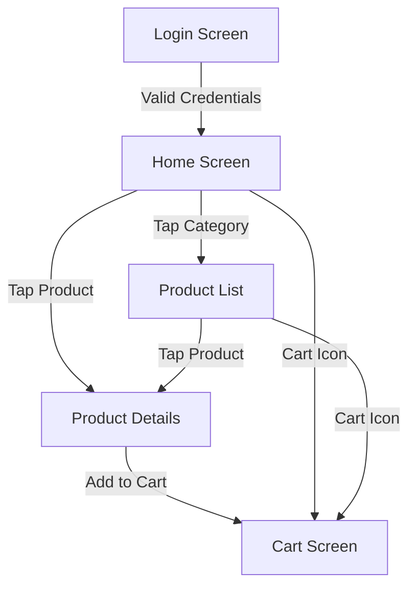

# 🛒 Sungod Home - Flutter E-Commerce App

<div align="center">


**A modern, feature-rich Flutter mobile application for e-commerce specializing in unpolished grains, pulses, millets, and organic products.**

[Features](#-features) • [Architecture](#️-architecture) • [Getting Started](#-getting-started) • [Screenshots](#-screenshots) • [Tech Stack](#-tech-stack)

</div>

---

## 📱 Features

### ✨ Core Functionality

- 🔐 **Authentication System**
  - Secure login with email/password validation
  - Form validation and error handling
  - Hardcoded fallback for testing

- 🏠 **Home Screen**
  - Dynamic promotional banners
  - Product categories with smooth navigation
  - Featured products section
  - Daily best selling products
  - Recently added items
  - Popular and trending products
  - Pull-to-refresh functionality

- 📦 **Product Management**
  - Grid view product listing
  - Category-based filtering
  - Detailed product information
  - Image gallery support
  - Price display with discounts
  - Stock availability indicators

- 🛒 **Shopping Cart**
  - In-memory cart management
  - Add/remove products
  - Quantity controls (increment/decrement)
  - Real-time price calculation
  - Cart summary with item count
  - Badge indicators

- 🎨 **User Experience**
  - Modern, clean UI design
  - Responsive layouts
  - Loading states with indicators
  - Error handling with retry options
  - Empty state messages
  - Smooth navigation transitions

---

## 🏗️ Architecture

This project follows **MVVM (Model-View-ViewModel)** architecture pattern with clean code principles.

```
lib/
├── 📁 core/                    # Core utilities and configurations
│   ├── 📁 constants/          # App-wide constants (API URLs, endpoints)
│   ├── 📁 theme/              # App theme and styling
│   └── 📁 utils/              # Utility classes (logger, extensions)
│
├── 📁 data/                   # Data layer
│   ├── 📁 models/             # Freezed data models (immutable)
│   ├── 📁 repositories/       # Data repositories (business logic)
│   └── 📁 services/           # API service (Dio HTTP client)
│
├── 📁 features/              # Feature-based modules
│   ├── 📁 auth/              # Authentication feature
│   │   ├── 📁 view/          # UI screens and widgets
│   │   └── 📁 viewmodel/    # ViewModels with Provider
│   │
│   ├── 📁 home/              # Home screen feature
│   │   ├── 📁 view/
│   │   └── 📁 viewmodel/
│   │
│   ├── 📁 products/          # Products feature
│   │   ├── 📁 view/          # Product list & details screens
│   │   └── 📁 viewmodel/
│   │
│   └── 📁 cart/              # Shopping cart feature
│       ├── 📁 view/
│       └── 📁 viewmodel/
│
├── 📁 router/                # Navigation configuration (GoRouter)
└── 📄 main.dart              # App entry point
```

### 🎯 Architecture Benefits

- ✅ **Separation of Concerns**: Clear boundaries between UI, business logic, and data
- ✅ **Testability**: Easy to unit test ViewModels and repositories
- ✅ **Maintainability**: Feature-based structure for easy navigation
- ✅ **Scalability**: Easy to add new features without affecting existing code
- ✅ **Type Safety**: Freezed models ensure compile-time type checking

---

## 🛠️ Tech Stack

### Core Technologies

| Technology | Purpose | Version |
|------------|---------|---------|
| **Flutter** | Cross-platform framework | 3.10.4+ |
| **Dart** | Programming language | 3.10.4+ |
| **Provider** | State management | ^6.1.1 |
| **GoRouter** | Navigation & routing | ^13.0.0 |
| **Dio** | HTTP client | ^5.4.0 |
| **Freezed** | Code generation | ^2.4.6 |

### Key Packages

```yaml
dependencies:
  provider: ^6.1.1              # State management
  freezed_annotation: ^2.4.1    # Immutable models
  json_annotation: ^4.8.1       # JSON serialization
  dio: ^5.4.0                   # HTTP client
  go_router: ^13.0.0            # Navigation
  cached_network_image: ^3.3.1   # Image caching
  pull_to_refresh: ^2.0.0       # Pull to refresh

dev_dependencies:
  build_runner: ^2.4.7          # Code generation
  freezed: ^2.4.6                # Freezed generator
  json_serializable: ^6.7.1     # JSON generator
```

---

## 🚀 Getting Started

### 📋 Prerequisites

Before you begin, ensure you have the following installed:

- **Flutter SDK** (3.10.4 or higher)
- **Dart SDK** (comes with Flutter)
- **Android Studio** / **VS Code** with Flutter extensions
- **Android/iOS emulator** or physical device
- **Git** (for version control)

### 🔧 Installation

#### 1. Clone the Repository

```bash
git clone <repository-url>
cd alisons
```

#### 2. Install Dependencies

```bash
flutter pub get
```

#### 3. Generate Code (Freezed Models)

```bash
flutter pub run build_runner build --delete-conflicting-outputs
```

> 💡 **Tip**: Use `watch` mode for automatic regeneration during development:
> ```bash
> flutter pub run build_runner watch --delete-conflicting-outputs
> ```

#### 4. Run the App

```bash
flutter run
```

### 🔐 Login Credentials

For testing purposes, use these credentials:

| Field | Value |
|-------|-------|
| **Email** | `mobile@alisonsgroup.com` |
| **Password** | `12345678` |

> ⚠️ **Note**: The app currently uses hardcoded validation. API integration is implemented but falls back to hardcoded check if API is unavailable.

---

## 🌐 API Configuration

### Base URLs

- **API Base URL**: `https://sungod.demospro2023.in.net/api`
- **Image Base URL**: `https://sungod.demospro2023.in.net`

### API Endpoints

| Method | Endpoint | Description |
|--------|----------|-------------|
| `POST` | `/login` | User authentication |
| `GET` | `/home` | Home screen data (banners, categories, products) |
| `GET` | `/products` | Product list (supports `by=category`, `value=<slug>`) |
| `GET` | `/product-details` | Product details (`id=<product_id>`) |
| `GET` | `/cart` | Get cart items |
| `POST` | `/cart/add` | Add item to cart |

### Example API Calls

```dart
// Get products by category
GET /products?by=category&value=unpolished-pulses&page=1&per_page=20

// Get product details
GET /product-details?id=123
```

---

## 📱 App Flow



### Screen Navigation

1. **Login Screen** → User authentication with validation
2. **Home Screen** → Displays banners, categories, and product sections
3. **Product List** → Grid view with category filtering
4. **Product Details** → Detailed view with add to cart
5. **Cart** → Shopping cart with quantity controls

---

## 🎨 UI/UX Features

### Design Principles

- 🎯 **Clean & Modern**: Minimalist design following Material Design guidelines
- 📱 **Responsive**: Adapts to different screen sizes
- ⚡ **Performance**: Optimized with image caching and lazy loading
- 🔄 **Feedback**: Loading states, error messages, and success indicators
- ♿ **Accessible**: Proper contrast ratios and touch targets

### State Management

The app uses **Provider** for state management:

| ViewModel | Purpose |
|-----------|---------|
| `CartViewModel` | Manages shopping cart state (in-memory) |
| `AuthViewModel` | Handles authentication logic |
| `HomeViewModel` | Manages home screen data |
| `ProductsViewModel` | Manages product list data |
| `ProductDetailsViewModel` | Manages product details |

---

## 📝 Code Generation

### Freezed Models

After modifying Freezed models, regenerate code:

```bash
flutter pub run build_runner build --delete-conflicting-outputs
```

### Watch Mode (Development)

Automatically regenerate on file changes:

```bash
flutter pub run build_runner watch --delete-conflicting-outputs
```

---

## 🔧 Development

### Project Structure Best Practices

- ✅ **Separation of Concerns**: Clear boundaries between layers
- ✅ **Reusability**: Reusable widgets and components
- ✅ **Type Safety**: Freezed models ensure type safety
- ✅ **Error Handling**: Comprehensive error handling at all layers
- ✅ **Code Quality**: Clean, readable, and maintainable code

### Running Tests

```bash
flutter test
```

### Building for Production

#### Android

```bash
flutter build apk --release
```

#### iOS

```bash
flutter build ios --release
```

---

## 📊 Project Status

### ✅ Completed Features

- [x] Authentication system
- [x] Home screen with all sections
- [x] Product listing (grid view)
- [x] Product details page
- [x] Shopping cart functionality
- [x] Navigation system
- [x] State management
- [x] API integration
- [x] Error handling
- [x] Loading states

### 🚧 Future Enhancements

- [ ] Wishlist functionality
- [ ] Search functionality
- [ ] Filter and sort options
- [ ] Checkout flow
- [ ] User profile
- [ ] Order history
- [ ] Product reviews and ratings
- [ ] Push notifications
- [ ] Offline support
- [ ] Dark mode

---

## 🐛 Known Issues / Limitations

| Issue | Status | Notes |
|-------|--------|-------|
| Cart persistence | ⚠️ By Design | Cart is in-memory only (as per requirements) |
| Wishlist | 🚧 Not Implemented | UI ready but functionality pending |
| Search | 🚧 Not Implemented | Placeholder UI exists |
| Filter/Sort | 🚧 Not Implemented | UI ready but functionality pending |
| Checkout | 🚧 Not Implemented | Basic UI exists |
| Related Products | 🚧 Not Implemented | Placeholder on product details |

---

## 📄 Assumptions & Notes

### 🔐 Authentication

- Currently uses hardcoded validation
- API integration is implemented but falls back to hardcoded check if API fails
- Token management ready for future implementation

### 🛒 Cart Management

- Cart state is maintained in-memory using Provider
- No persistence implemented (as per requirements)
- Cart data is lost on app restart

### 🌐 API Integration

- Models are designed to handle various API response structures
- App gracefully handles missing or null data
- Comprehensive error handling with user-friendly messages

### 🖼️ Images

- Uses cached network images with placeholder and error widgets
- Image URLs are automatically prefixed with base URL if needed

### 🧭 Navigation

- Uses GoRouter for declarative navigation
- Type-safe routes with query parameters
- Deep linking support ready

---

## 🤝 Contributing

This is a machine test project. For contributions:

1. Fork the repository
2. Create a feature branch (`git checkout -b feature/AmazingFeature`)
3. Commit your changes (`git commit -m 'Add some AmazingFeature'`)
4. Push to the branch (`git push origin feature/AmazingFeature`)
5. Open a Pull Request

---

## 📄 License

This project is created for machine test purposes.

---

## 👨‍💻 Author

**Built with ❤️ using Flutter**

---

## 📞 Support

For issues, questions, or suggestions:

- 📧 Email: [Your Email]
- 🐛 Issues: [GitHub Issues]
- 💬 Discussions: [GitHub Discussions]

---

<div align="center">

**⭐ If you find this project helpful, please give it a star! ⭐**

Made with Flutter 💙

</div>
